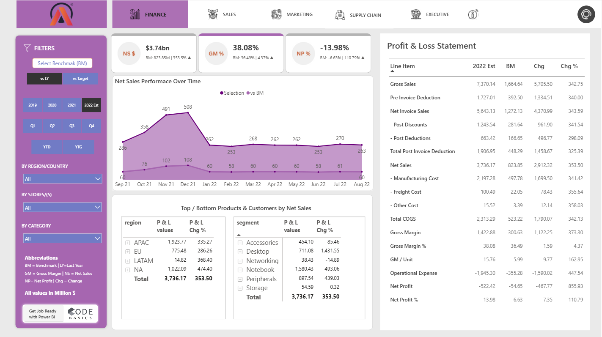
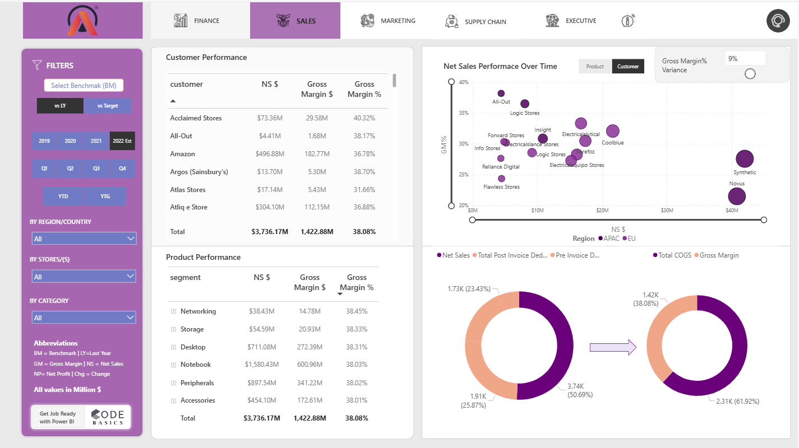

# Business Insights 360 — Power BI Project  

## 📌 Project Overview  

AtliQ Hardware has grown rapidly in recent years and decided to adopt **Power BI analytics** for the first time to stay competitive and enable data-driven decision-making across the organization.  

This project was built as part of the **Codebasics Business Insights 360 Power BI Course** and delivers insights across **Finance, Sales, Marketing, and Supply Chain** through an integrated analytics dashboard.  

The objective was to convert scattered business data into a structured decision-support system that helps stakeholders understand performance, diagnose issues, and take informed actions.  

🔗 **Course Link:** https://codebasics.io  

🔗 **Live Power BI Dashboard:** https://app.powerbi.com/view?r=eyJrIjoiY2JjNTVhOTgtZGJhMy00YTMxLTkzM2MtOGRkZmQ3MGM2OWVlIiwidCI6ImM2ZTU0OWIzLTVmNDUtNDAzMi1hYWU5LWQ0MjQ0ZGM1YjJjNCJ9  

*(Power BI login may be required depending on access settings.)*

---

## 🏢 Company Background — AtliQ Hardware  

AtliQ Hardware is a global consumer electronics company that sells computers and accessories through three primary channels:  

- **Retailers** (Brick & Mortar stores)  
- **Direct** (Company-to-customer sales)  
- **Distributors**  

The company previously expanded into Latin America based on surveys, intuition, and basic Excel analysis — which resulted in significant financial losses. At the same time, competitors such as Dell were already leveraging advanced analytics to guide strategy and operations.  

To avoid repeating past mistakes and remain competitive, AtliQ Hardware initiated this Power BI analytics project to institutionalize data-driven decision-making.  

---

## 🎯 Project Objectives  

This project aimed to:  

- Build a **single source of truth** for business data  
- Enable **evidence-based decision-making** across departments  
- Provide clear visibility into **Finance, Sales, Marketing, and Supply Chain**  
- Reduce dependence on manual Excel reporting  
- Allow stakeholders to answer *“why did this happen?”* using data  

---

## 🛠 Tech Stack Used  

- **SQL (MySQL)** — Data extraction  
- **Power BI Desktop** — Report development  
- **Excel** — Initial data review  
- **DAX** — Measures and calculations  
- **DAX Studio** — Performance optimization  
- **Power BI Service** — Publishing, sharing, and refresh  

---

## 📊 Power BI Techniques Implemented  

During this project, the following Power BI techniques were applied:  

- Asking structured business questions before building dashboards  
- Creating calculated columns  
- Writing complex **DAX measures**  
- Designing a **Snowflake data model**  
- Using **Bookmarks** to switch between visuals  
- Page navigation using buttons  
- Handling divide-by-zero errors using `DIVIDE()`  
- Creating a **Date table using M language**  
- Dynamic titles based on applied filters  
- KPI indicators  
- Conditional formatting using icons and background colors  
- Publishing reports to Power BI Service  
- Configuring a personal gateway for auto-refresh  
- Creating Power BI Apps and managing workspaces  

---

## 🧱 Data Model  

The project follows a **Snowflake schema**, connecting fact tables (Sales, Forecast, Finance) with dimension tables (Customer, Market, Product, Date) to ensure scalability and performance.  

---

## 📱 Dashboard Pages (Screenshots)  

### 🏠 Home Page  
  
Central navigation hub for all report views.  

### 📈 Finance View  
  
Shows:  
- Net Sales  
- Gross Margin  
- Net Profit  
- Detailed Profit & Loss statement  
- Year-on-year benchmark comparison  

### 📊 Sales View  
  
Analyzes:  
- Customer performance  
- Product performance  
- Regional trends  
- Margin variance  

### 📢 Marketing View  
  
Evaluates:  
- Segment profitability  
- Net Profit by product category  
- Gross margin bifurcation  

### 🚚 Supply Chain View  
  
Tracks:  
- Forecast accuracy  
- Net error  
- High-risk customers and products  
- Demand planning performance  

### 🧾 Executive View  
  
Provides leadership with:  
- High-level KPIs  
- Top 5 customers  
- Top 5 products  
- Regional performance overview  

---

## 📚 Business Terms Used  

- Gross Price  
- Pre-invoice deductions  
- Post-invoice deductions  
- Net Invoice Sale  
- Gross Margin  
- Net Sales  
- Net Profit  
- COGS (Cost of Goods Sold)  
- YTD — Year to Date  
- YTG — Year to Go  
- Direct / Retailer / Distributor / Consumer  

---

## 🎯 Project Outcome  

This dashboard enables:  

- Faster, data-driven decision-making  
- Better demand forecasting  
- Clear profitability tracking  
- Stronger stakeholder communication  
- Deeper diagnostic analysis using visuals and measures  

This project demonstrates my ability to:  

- Understand real business problems  
- Design a robust data model  
- Build interactive Power BI dashboards  
- Translate data into actionable insights  

---

## 📌 Access to the Live Dashboard  

The full interactive Power BI report is available here:  

🔗 **Live Power BI Dashboard:**  
https://app.powerbi.com/view?r=eyJrIjoiY2JjNTVhOTgtZGJhMy00YTMxLTkzM2MtOGRkZmQ3MGM2OWVlIiwidCI6ImM2ZTU0OWIzLTVmNDUtNDAzMi1hYWU5LWQ0MjQ0ZGM1YjJjNCJ9  

